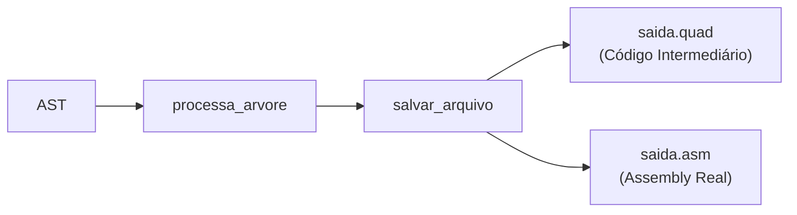

# Síntese Final — Gerador de Quádruplas do Compilador C-

## Arquitetura de Duas Fases

O compilador percorre a AST uma única vez (`processa_arvore`) e gera simultaneamente dois arquivos:



- **`saida.quad`** — Quádruplas no formato `(OP, ARG1, ARG2, RES)`. Operações complexas ficam em UMA quádrupla.
- **`saida.asm`** — Assembly real do processador. O switch-case expande cada quádrupla.

---

## Tabela Completa de Instruções

### Quádruplas 1:1 (ficam iguais no .asm)
| Quádrupla | Descrição | Assembly |
|---|---|---|
| `ADD v1, v2, rd` | Soma | `ADD rd, v1, v2` |
| `SUB v1, v2, rd` | Subtração | `SUB rd, v1, v2` |
| `MULT v1, v2, rd` | Multiplicação | `MULT rd, v1, v2` |
| `DIV v1, v2, rd` | Divisão | `DIV rd, v1, v2` |
| `LOAD var, -, rd` | Carrega da RAM | `LOAD rd, var` |
| `STORE val, var, -` | Salva na RAM | `STORE val, var` |
| `JUMP label` | Salto incondicional | `JUMP label` |
| `BNE/BEQ/BLE/BGT/BLT/BGE` | Branch direto | Mesmo |
| `IN -, -, rd` | Lê entrada | `IN rd` |
| `OUT val` | Escreve saída | `OUT val` |
| `HALT` | Para o processador | `HALT` |

### Quádruplas que EXPANDEM no .asm
| Quádrupla | Significado | → Assembly |
|---|---|---|
| `LOADI num, -, rd` | Carrega constante | `ADDI rd, $zero, num` |
| `PARAM val` | Empilha argumento | `STORE_STACK val` |
| `ARG nome` | Recebe argumento | `LOAD_STACK $at` + `STORE $at, nome` |
| `CALL func, n, rd` | Chama função | `JAL $ra, func` + `LOAD_STACK rd` |
| `RET val` | Retorna valor | `LOAD_STACK $ra` + `STORE_STACK val` + `JR $ra` |
| `RET -` | Retorna (void) | `LOAD_STACK $ra` + `JR $ra` |
| `SAVE_RA` | Protege endereço | `STORE_STACK $ra` |
| `FUN tipo nome` | Início de função | `nome:` (label) |
| `LAB label` | Label | `label:` |

---

## Convenção de Chamada (Pilha Pura)

### O Chamador faz:
```
1. PARAM (empilha args em ordem reversa R→L)
2. CALL func → expande para JAL + LOAD_STACK resultado
```

### A Função faz:
```
1. ARG u (pop param do topo — estava no topo pois empilhamos reverso)
2. ARG v (pop próximo param)
3. SAVE_RA (push $ra na pilha — protege contra recursão)
4. ... corpo da função ...
5. RET valor → expande para:
   - LOAD_STACK $ra (restaura endereço)
   - STORE_STACK valor (empilha resultado)
   - JR $ra (volta)
```

### Sincronia da Pilha (por que funciona):
```
Chamador empilha:  [v, u]          (u no topo)
Função pop u:      [v]
Função pop v:      []
Função push $ra:   [$ra]
... executa ...
Função pop $ra:    []
Função push ret:   [resultado]
Chamador pop ret:  []              ← Pilha limpa!
```

---

## Reciclagem de Registradores

- Pool de 64 registradores ($t0 a $t63)
- Vetor binário `regs_vetor[64]`: 0 = livre, 1 = ocupado
- `alocar_reg()` → encontra o primeiro livre
- `liberar_reg()` → marca como livre após uso
- Resultado: máximo reuso, o gcd.txt usa apenas $t0 a $t3

---

## Saída para `gcd.txt`

### saida.quad (41 linhas — código intermediário)
```
(JUMP, main, -, -)
(FUN, int, gcd, -)
(ARG, u, -, -)
(ARG, v, -, -)
(LOAD, v, -, $t0)
(LOADI, 0, -, $t1)
(BNE, $t0, $t1, L0)
(LOAD, u, -, $t0)
(RET, $t0, -, -)
(JUMP, L1, -, -)
(LAB, L0, -, -)
... cálculo u-u/v*v ...
(PARAM, $t1, -, -)
(LOAD, v, -, $t0)
(PARAM, $t0, -, -)
(CALL, gcd, 2, $t0)
(RET, $t0, -, -)
(LAB, L1, -, -)
(END, gcd, -, -)
(FUN, int, main, -)
(ALLOC, x, main, -)
(ALLOC, y, main, -)
(IN, -, -, $t0)
(STORE, $t0, x, -)
(IN, -, -, $t0)
(STORE, $t0, y, -)
(LOAD, y, -, $t0)
(PARAM, $t0, -, -)
(LOAD, x, -, $t0)
(PARAM, $t0, -, -)
(CALL, gcd, 2, $t0)
(OUT, $t0, -, -)
(END, main, -, -)
(HALT, -, -, -)
```

### saida.asm (47 linhas — assembly real)
```asm
JUMP main
gcd:
LOAD_STACK $at
STORE $at, u, 0
LOAD_STACK $at
STORE $at, v, 0
STORE_STACK $ra
LOAD $t0, v
ADDI $t1, $zero, 0
BNE $t0, $t1, L0
LOAD $t0, u
LOAD_STACK $ra
STORE_STACK $t0
JR $ra
JUMP L1
L0:
LOAD $t0, u
LOAD $t1, u
LOAD $t2, v
DIV $t3, $t1, $t2
LOAD $t1, v
MULT $t2, $t3, $t1
SUB $t1, $t0, $t2
STORE_STACK $t1
LOAD $t0, v
STORE_STACK $t0
JAL $ra, gcd
LOAD_STACK $t0
LOAD_STACK $ra
STORE_STACK $t0
JR $ra
L1:
main:
STORE_STACK $ra
IN $t0
STORE -, $t0, x
IN $t0
STORE -, $t0, y
LOAD $t0, y
STORE_STACK $t0
LOAD $t0, x
STORE_STACK $t0
JAL $ra, gcd
LOAD_STACK $t0
OUT $t0
HALT
```
